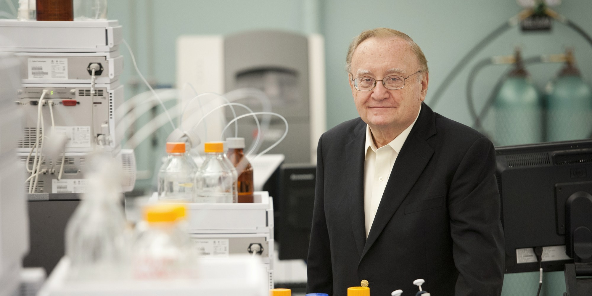

I wrote the below for Northeastern's College of Science in 2016.

First off, Dr. Karger isn’t retiring. “I’m not going to just go fishing,” said Dr. Barry Karger, director of the Barnett Institute, “and I don’t play golf.” Three American Chemistry Society awards, many international medals, 53 years of teaching, and 43 years as director of the Barnett Institute later, Karger has no plans slowing down in analytical chemistry, a field he has helped shape. Regardless, at his April 20 Retirement Colloquium (a misnomer), Karger gave a profound career-spanning talk, “Chemical and biochemical analysis: past, present and future” in which he discussed his experiences and what he thinks it takes to succeed as a scientist.

Karger’s enjoyed science since he was a kid, but he insists, he was never a “science freak.” In fact, as an undergraduate at MIT he had plans to attend medical school. His change of trajectory into analytical chemistry was the result of one influential adviser: Prof. “Buck” Rogers. Today remembered as a pioneer in electrochemistry and analytical separations, Rogers is perhaps known best for having being a transformative mentor. Karger did his senior thesis in Rogers’ lab as an undergraduate. “He was a beloved professor,” Karger said, “My family lived in Brookline, and when I was an undergraduate he and his wife would come over to house and have dinner. He was like Mr. Chips in a way.” Like Rogers, Karger went into separation chemistry.

Dr. Barry Karger addresses a packed room during his April 20, 2016 Retirement Colloquium.
Dr. Barry Karger addresses a packed room during his April 20, 2016 Retirement Colloquium.

The center of Karger’s philosophy toward science is that you need to know the detailed structure and amount of the molecules you’re working with. “If you don’t, where are you?” asked Karger. He sees the determination of molecules as the center of a wheel, with applications as spokes that surround it. No analytical chemistry and separation, no drugs, no forensics, no life science.
After his undergraduate education at MIT in 1960, Karger attended Cornell University to work under Prof. Donald Cooke, another well-known chemist who made significant advances in spectroscopy, electrochemistry, and other analytical techniques. Karger’s PhD research included the creation of a flame ionization detector and fundamental work into optimizing separations by use of time normalization. He completed his PhD in three years. From there, Dr. Karger applied to and became an assistant professor at Northeastern University in September 1963 at the age of 24.

Karger’s earliest work at Northeastern was in gas chromatography (GC) and its fundamentals, a continuation of his PhD work. After several years, there became a fork in the road. GC was split between two techniques: capillary GC versus packed GC. Both methods had pros and cons, but packed GC was the early favorite. It was more widely used and produced consistent results, but was time-consuming to set up. The other method, capillary GC, was newer and less studied. It was an unknown with real potential. Studying the differences between the two techniques, Karger decided to invest his research into capillary GC, reasoning that its ease of set-up would be the major deciding factor. Karger was correct, and capillary GC is now the predominant method of the two.

Not long after, in 1964 — just a year after coming to Northeastern — Karger encountered Csaba Horváth, a post-doc at Harvard Medical School. At Horváth’s suggestion, Karger began to investigate another nascent field: liquid chromatography (LC). At first glance, LC was a poor bet. Most analytical chemists were working with GC, and the existing equipment was tailored toward GC, which was both faster and more efficient. Regardless, Karger and his colleagues believed in the long-term potential of LC. In the late 60s and early 70s he and his collaborators went on to dramatically shape the field, both theoretically and with practical applications. They were among the first to develop reversed phase liquid chromatography. LC is one of the most commonly used separation techniques in analytical chemistry today with a market size of close to \$10 billion.

Dr. Karger talked about his career and where analytical chemistry is headed.
Dr. Karger talked about his career and where analytical chemistry is headed.

When new technologies emerge, the route to take is not so obvious. “What do you bet on?” asked Karger. “It’s not always clear; you often have two or more camps.” The answer, Karger said, lies in familiarity with the fundamentals. “To understand what the real problem is, is sometimes very sophisticated. It’s not always what you think it is.”
Among those to reflect on Karger’s career at the Retirement Colloquium was Dr. Alexei Belenky, a research fellow at Genzyme and a former post-doc of Karger’s. “Often times scientists have too narrow a focus,” said Belenky. “One of the things I learned from Dr. Karger is that there cannot be a favorite molecule or technique. The focus should always be on the biggest demand for analysis. He has always moved to a new analytical area when the area of his current efforts was sufficiently developed, thus leaving behind those scientists who preferred to stay in the ‘comfort zone.’” As an example, Belenky recalled, “he had developed the philosophy for the characterization of biosimilars before the FDA had defined what the biosimilar was.”

In 1973, Karger founded what is today known as the Barnett Institute, an internationally recognized hub for analytical chemistry and the development and application of separation science, protein analysis, DNA sequencing and, most recently, “omics.” Karger recalls science being fundamentally different at the time of the institute’s founding. “Application was a dirty word,” said Karger. A former Northeastern professor told him that analytical chemistry was analogous to taking a 78 rpm record and trying to play it at 33 rpm. Furthermore, the close relationship between analytical chemistry and medicine didn’t yet exist. “Biology was a descriptive science, it wasn’t chemical or molecular,” said Karger. “Chemistry and biology were like oil and water; they did not mix.” The institute’s earliest partnership was with the Northeastern’s School of Criminology and Criminal Justice. He remembers meeting the director of the FBI on trips to Washington, and one of the institute’s earliest grants was from the Department of Justice.

Dr. Paul Vouros, a Northeastern professor of chemistry, spoke at the colloquium remembering the early days of the institute: “The establishment of an institute in those times was unheard of. There was hardly any research infrastructure, and it was mostly in the College of Engineering.” Since its founding 43 years ago, more than 400 PhD’s, post-docs, and staff have passed through the Barnett Institute with well more than 1,000 papers published so far. The institute has successfully transitioned from one area of active research to another, shifting from small polar molecules in the 70s to peptides and drugs in the 80s, DNA in the 90s (with more than 40 percent of the human genome being sequenced by methods developed by Karger’s lab), and now proteomics, metabolomics, and protein analysis of individual cells. Vorous, like Belenky, believes that it was Karger’s willingness to continually take on new problems that enabled the institute to succeed as it has, “Barry has the belief that in scientific research, one cannot stay idle. We must constantly plan for the next step, even though we’re in the middle of the task at hand,” said Vouros, “his collaborators benefitted greatly.”

Despite its external achievements, Karger views a main role of the institute as one of mentorship. “The institute is an environment more than anything else,” said Karger, “It’s great to see the research, the accomplishments, and the impact, but the big thing is that you get these people, you help them along, and then when you see them succeed, maybe you had something to do with it.” When asked what makes for a great mentor, Karger replied, “One important thing is to really care for the people. Try to help them, rather than ask what they’re bothering you for.” For students, Karger said they should train themselves to think critically. “What’s the competition, what’s the goal of the project?” he asked. “Integrate, and don’t be afraid of change.” During his talk, Karger said that, “there’s one constant: change.”

Dr. Barry Karger surrounded by fellows of the Barnett Institute.
Dr. Barry Karger surrounded by fellows of the Barnett Institute.

Today the institute is endowed with over \$8 million and has nearly 50 scientists. The interim Chair of the Department of Chemistry and Chemical Biology, Associate Professor Michael Pollastri, believes the institute is a unique opportunity for its researchers. “It’s a perfect combination of doing high-powered and highly relevant research, with industrial connections to ensure that the research is translated into practice, and that students and trainees have excellent job prospects when completing their studies.”
Under Karger’s leadership, the Barnett Institute has built a reputation for its mentoring, cutting-edge research, and partnership with the neighboring biotech companies. “Northeastern, I’ve always said, has a unique advantage, in that it’s a co-op school,” said Karger. “When I first began, industry and academia were in two different camps. Today, more and more, the ties are occurring. Those ties are very important. You can then understand the real problems.”

In honor of Karger’s impact on both analytical chemistry and the Barnett Institute, the Barry L. Karger Medal for excellence in bioanalytical research was established. Its first recipient—Professor Matthias Mann, Director of Proteomics and Signal Transduction at Max Planck Institute of Biochemistry—was awarded the medal last fall for his work on proteomics and advances in mass spectrometry. Mann said at the time, “Barry has been a great pioneer in our field for as long as I can remember, so I am overwhelmed by being the recipient of his award. Visiting Northeastern University has been a great pleasure, not the least because of all the exciting new technology developments going on here.” Looking toward forward awardees, Karger imagines that analytical chemistry will bend toward systems level approaches to biology and chemistry. “Today it’s strange that all we can do is manage,” suggested Karger, “There are new approaches coming, we’re going to use much more DNA and RNA. The field is also moving toward single cell analysis.”

Describing his approach toward science, Karger said, “There are a lot of opportunities. If you understand what’s going on, you can begin to think about what’s really needed… You don’t get bored.”
