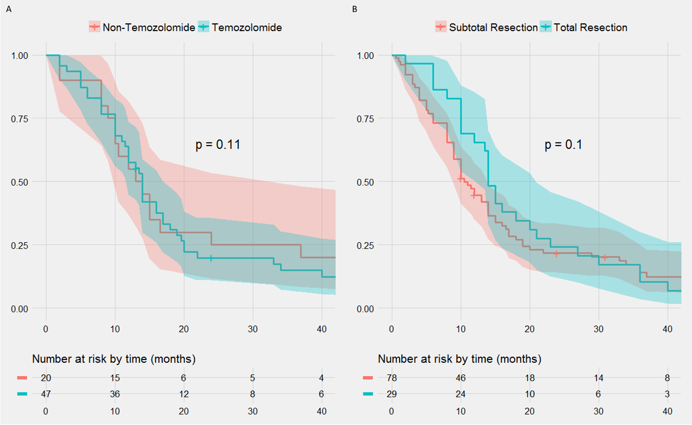

In my research group at BIDMC, there was a half-finished literature review of spinal cord Glioblastoma multiforme (scGBM).
To finish the review I added all recent records and papers that included case reports of patients that had
scGBM.

I then did some basic survival analysis, which was all new to me. The idea is to look at all major treatments and fixed patient
characteristics across the total population and find those that correlate with improved outcomes.

The value of a review like this is two-fold. First, notable correlations that are robust, like the necessity of radiation
as it correlates with treatment outcomes, is useful information. Second, reviews like it are a useful repository for
future investigations of the disease. Given the rarity of scGBM, it's unlikely there will ever be a clinical trial.

Ideally, all clinicians would, upon diagnosising a patient with a rare disease, submit the patient characteristics and
treatment information to an anonymized database so it can be screened. The SEERs database is one such example but,
as will be discussed, lots of useful information is excluded.

### Methods

Additional records were found through two sources: PubMed and Google Scholar. First, titles were screened for those that included some combination of "spinal" and "glioma" or "gliosarcoma" or "glioblastoma" in the title. Additional records were identified through the citations, and these were added as well (in a method called "hand-searching").

*A prisma diagram for the source of the imported records*

### Challenges

The primary challenge in this analysis is that the most interesting results would be which treatments correlate with
improved patient outcome. Ideally, this could be done in a Cox proportional hazards model where treatments are treated as
covariates.

The issue is that codifying treatment of patients, against survival or progression free survival, implies
that the treatments are fixed through time. This leads to a common pitfall in these types of analyses: immortal time bias.

Immortal time bias can be corrected for when the time of treatment is known for all treatments. So patients are, before
having a treatment administered, codified as lacking that treatment. After its administration, they're converted to the 
treatment group (as far as the CPH model is concerned). The problem with this data-set is that time of treatment information
is virtually absent. All but a handful of records, out of ~170 in the literature right now, lack time of treatment information.
So investigations of how treatments correlated with outcome are out of the picture.

This leaves other questions, like how age at diagnosis, sex, or tumor location correlate with outcome (none of which are variable with time).
We also compared survivals within treatment groups when only the degree or type of treatment differed. For example, we compared
subtotal vs total resection, since both are, likely, administed at the same time in a patient's treatment timeline.

### Results

No treatment type (with group) correlated with significant differences in overall survival.

*Treatment type/degree versus outcome*

The female sex was very negatively correlated with overall survival, but nothing else of reached significance (log-rank p-value on the Kaplan-Myers).

*Patient characteristics versus outcome*

### Conclusions

While the reivew was interesting, and learning about the cox proportional hazards model and survival analysis was enjoyable, the dataset was
unfortunately lacking. It's suprising that more information isn't reguarly collected, and it's hard to image a significant
improvment in understanding for this disease so long as the minimum information is reported in case reports.

One solution would be to require, on submission of a case report to a medical journal, a checklist of information. The checklist
would include detailed information, such as time between diagnosis and each treatment administed, so time-dependent CPH models could be generated.
It's suprising this is not already a standard requirement, but, even in the case reports post-2015, there was consistently inadequate information.
Second, a centralized database could be put in place. This seems less likely for probably valid concerns about of patient privacy.
