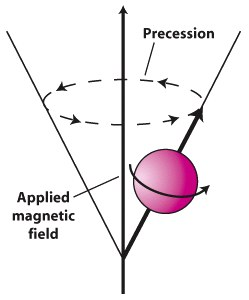
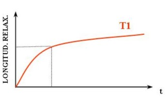
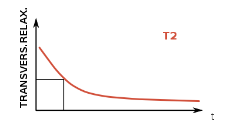
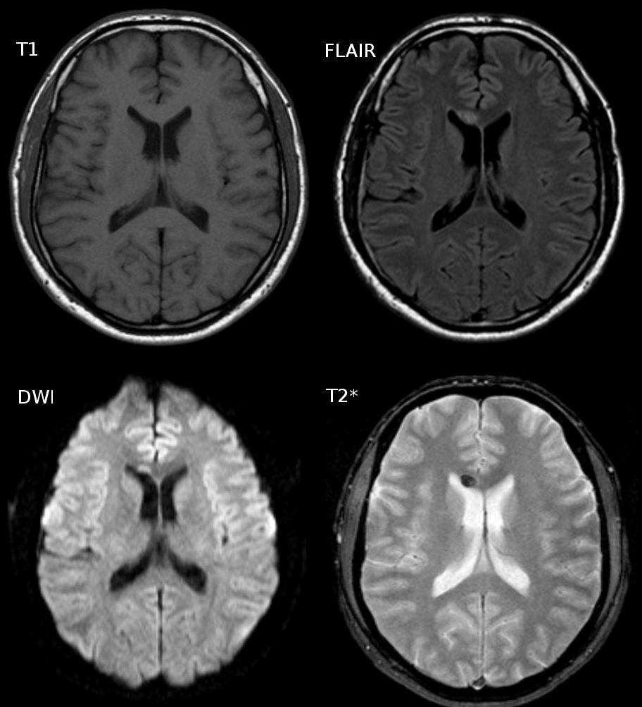
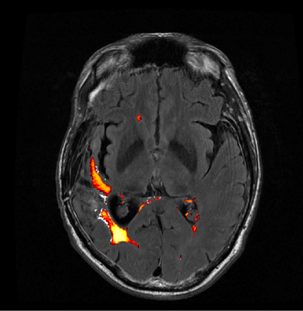
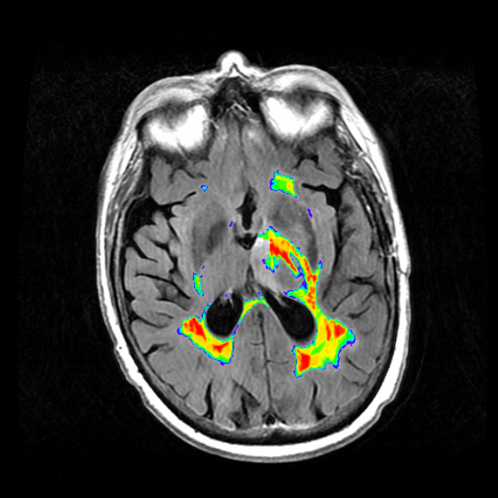
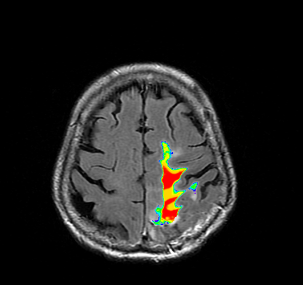

Over the last couple weeks, I've been trying to find an efficient way to automatically quantify the volume and intensity of T2 flair in the MRI scans of patients with Glioblastoma multiforme.

### MRI Overview

An MRI is a visual representation of [induced changes in the magnetization of the body's water protons](http://casemed.case.edu/clerkships/neurology/Web%20Neurorad/MRI%20Basics.htm). In an MRI, protons are aligned with a large, external magnetic field (one 50,000 times stronger than the Earth's magnetic field). This induced alignment is either parallel (majority) or antiparallel (minority) to the magnetic field. Parallel alignment to the field, in the same direction as the magnetic vector, is called [longitudinal magnetization](https://www.youtube.com/watch?v=Ok9ILIYzmaY). In parallel or antiparallel alignment with the magnetic vector, the protons [precess](https://en.wikipedia.org/wiki/Precession) around the magnetic vector in phase with on another, like synchronized spinning tops. The rate of the protons' precession around the magnetic vector is proportional to the strength of the applied magnetic field.



These aligned protons are then hit with RF pulses (at the same frequency as the precession rate) to knock some of them out into antiparallel alignment, decreasing the longitudinal magnetization. The aligned protons, both parallel and antiparallel, then begin to precess in phase again, in sync, but with fewer protons in parallel alignment with the magnetic field. Because the net magnetic vectors of the protons is now split between parallel and antiparallel directionality, and the protons are precessing in sync with one another, the net magnetic alignment vector spins perpendicular to the MRI's magnetic vector in [transverse magnetization](http://mrishark.com/te.html).

This is a higher energy state for the protons. When the RF pulses stop, the protons will fall back into parallel alignment with the MRIs magnetic field, [relaxing](https://en.wikipedia.org/wiki/Physics_of_magnetic_resonance_imaging#Resonance_and_relaxation). This relaxation is accompanied by a release of energy measured as an RF signal. The return of longitudinal magnetization, as the protons realign with the magnetic field, is measured as [T1](https://en.wikipedia.org/wiki/Physics_of_magnetic_resonance_imaging#Resonance_and_relaxation).



T2, on the other hand, corresponds to the rate at which protons in the targeted plane go out of phase with one another. While the protons had been precessing in phase during the application of an RF pulse, they fall back into a random distribution without the resonance of the RF pulses, and this decay of "sync-ness" in the transverse plane is [T2](https://en.wikipedia.org/wiki/Physics_of_magnetic_resonance_imaging#Resonance_and_relaxation). MRI is useful for differentiating tissues because the rate of T1 and T2 relaxation [differs across type types](https://www.ncbi.nlm.nih.gov/pmc/articles/PMC1121941/).



### FLAIR

Besides the difference between T1 and T2, MRI imaging is distinguishable by the [repetition time (TR)](http://casemed.case.edu/clerkships/neurology/Web%20Neurorad/MRI%20Basics.htm) between of RF pulse application and the time of measurement of emitted RF waves relative to the application of the RF pulse, [time to echo (TE)](http://casemed.case.edu/clerkships/neurology/Web%20Neurorad/MRI%20Basics.htm). T2-weighted images generally have longer TR and TE times than T1-weighted, though FLAIR has the longest TR and TE of all. Furthermore, in order to avoid having a high signal from CSF, as is standard with weighted-T2, the pulsed RF is applied with an inversion time that [prevents transverse magnetization of fluid](https://radiopaedia.org/articles/fluid-attenuation-inversion-recovery), thereby preventing its readout in the T2 MRI (and explaining the acronym: "Fluid-attenuated inversion recovery").


*Water has greater T2 than gray matter or white matter, which leads to a greater intensinty in the CSF of a T2 image (lower-right). FLAIR (top-right) nullify this effect*

The dark regions on the FLAIR image above (and the T2 image in relative terms) are due, in large part, to myelin. Myelin in the insulator that surrounds axons which make up a large portion of white matter. Because of its hydrophobic, fatty makeup, myelin rich areas are visible are hypointensive regions on the FLAIR image. Because of this relationship (myelin = dark), light regions on a FLAIR MRI can correspond to lesions associated with fluid retention. [Aging, multiple sclerosis, and deep white matter ischemia](https://www.ncbi.nlm.nih.gov/pmc/articles/PMC2593803/) all present as lighter regions on FLAIR image sets.

### Glioblastoma and FLAIR

Hyperintensity in T2/FLAIR of patients with Glioblastoma has generally been interpreted as [microscopic infiltration of the brain with inflammatory edema](http://www.redjournal.org/article/S0360-3016(16)31172-5/abstract). Research into the predictive capacity of T2 for patients with Glioblastoma suggests that progress (increase over a short period of time) [predicts](https://watermark.silverchair.com/nor200.pdf?token=AQECAHi208BE49Ooan9kkhW_Ercy7Dm3ZL_9Cf3qfKAc485ysgAAAbowggG2BgkqhkiG9w0BBwagggGnMIIBowIBADCCAZwGCSqGSIb3DQEHATAeBglghkgBZQMEAS4wEQQMlWiM2YgYIfoVtDopAgEQgIIBbRdPmMsIerl96spyc5GSwZUCIQXMInpUF2EMUaqq3isNKewpbOLNjcF4wYcGoSY4F5-oAlr4hCrqX9Uzh0oHaU-NHfxMRrhFf8O8PaIpBl36LWPFtCFgJQwbEKTXOIs4mcxKm-BBIfnMYdwxm24xxG0OaymKK380cyukD1AHuLeV9QIhfZ9PelAj-Y5BQvqxIUtYvVolyUEcsrPrsUPzlwBLbXfiZovutEMt0XwpJhk9AIrKrA2nCC4JKdlRQMyc8L2lNf_JNQgdTbq49tzeaoEo-BMhNJorFQj6FXiit-Cl1BwmYD38XhqfFc8R98A4YVuF8TpdaENV5ZDiLTJJ_o-IdSMxcX9cxQBgGSl-9p8B1ShTyNJOGkCw13ajBxgJ0rpS6a6fgnsi0GuyKqKzMEvsyg1D3MLIhaH2o09eGkPle97mIlwQUWvdCkYu1z72w2KrwSu5mzlzms2suGFX1apcZkJwFypUKNl4-jq8) T1 progress and additional research is ongoing to see whether T2/FLAIR can [independently classify disease progression](http://clincancerres.aacrjournals.org/content/clincanres/early/2015/11/23/1078-0432.CCR-14-3040.full.pdf). Early results [are mixed](http://www.redjournal.org/article/S0360-3016(16)31172-5/abstract). The takeaways have been that T2/FLAIR is more subjective that its T1 counterpart. So T2/FLAIR should not yet be taken as a literal representation of disease progression. It is still of interest to my group, so I am sharing what I found to work, but it is not what it might look like (and the exact cause of T2 hyperintensity of patients with Glioblastoma is not known definitely, and may be a culmination of several factors).

### Existing Solutions

My lab's goal was to find trends between T2/FLAIR relative to treatment time. Some of the solutions available right now are below:

* [Wetter, 2016](https://www.ncbi.nlm.nih.gov/pubmed/26855828) -- FSL
* [Soh, 2016](http://ieeexplore.ieee.org/document/7872623/?reload=true) -- Supervised
* [QBrain](https://www.medis.nl/assets/QBrain.pdf) -- Proprietary
* [Schmidt, 2012](http://www.applied-statistics.de/lst.html) -- SPM

I went with the toolbox [Lesion Segmentation Tool](http://www.applied-statistics.de/lst.html) because it uses SPM, is open-source, and is fully automatic.

Another interesting solution, that I did not try but would be interested in using in the future, is [GLISTR](http://www.med.upenn.edu/sbia/glistr.html). It's a full standalone app, and it requires manual specification of seed points for each tissue type, but it promises to segment all of "cerebrospinal fluid, gray matter, white matter, vessel, edema, necrosis, enhancing tumor, non-enhancing tumor, cerebellum, and background." Given the prelimeary nature of the FLAIR enhancing region quantification project, it did not feel necessary to go through manually specifying each of these seed points.

### Lesion Segmentation Tool

The [Lesion Segmentation Tool](http://www.applied-statistics.de/lst.html) (LST) comes with two methods for segmenting lesions from T2 images. The first and most widely used is the lesion growth algorithm (LGA, [Schmidt, 2012](http://www.applied-statistics.de/lst.html)). Per the tool's docs:

>This algorithm is able to segment T2-hyperintense lesions from a combination of T1 and FLAIR images. It first segments the T1 image into the three main tissue classes (CSF, GM and WM). This information is then combined with the FLAIR intensities in order to calculate lesion belief maps. By thresholding these maps by a pre-chosen initial threshold (kappa) an initial binary lesion map is obtained which is subsequently grown along voxels that appear hyperintense in the FLAIR image. The result is a lesion probability map.

The second method, and the one that I used, was the Lesion Predication Algorithm. Again, per docs:

>As an alternative to the LGA the toolbox provides a further lesion segmentation algorithm, the lesion prediction algorithm (LPA). Its advantages over the LGA is that (a) it only requires a FLAIR image and (b) no parameters need to be set by the user. ... The LPA is usually faster and in general more sensitive than the LGA, so give it a try!

And that second part is why I opted for LPA; it requires no toying with a kappa threshold, does not necessitate T1 image, and is faster. LST also comes with a MATLAB script for longitudinal comparison of lesions, but the user must manually select each lesion output mask, so I did not implement this feature (instead opting to output the summation of the voxel intensities).

### Scripting

The patient directory structure here was, for each patient, a nested folder of dates as directories and, foreach date, a T1post and FLAIR subdirectory. So this script would creation lesion probability maps for all FLAIR images in a given patient directory.

```matlab
function FLAIR_path = find_flair()
% Need to work through a dir full of MRI dirs
% Generate the lesion area using the lesion prediction algorithm

D = dir;
D = D(~ismember({D.name}, {'.', '..'}));

% Loop thru all subdirectories
lesions = {};
for k = 1:numel(D)
    currD = D(k).name;
    cd(currD);
    cd('FLAIR');

    % load all images
    images = dir;
    images = images(~ismember({images.name}, {'.', '..'}));
    images = {images.name};
    images = arrayfun(@(x) fullfile(pwd, filesep, x), images);
    images = char(images);

    % convert to nii
    header_array = spm_dicom_headers(images);
    nifti_image = spm_dicom_convert(header_array, 'all', 'flat', 'nii');

    % run LST algo on nii
    nifti = char(nifti_image(1).files);
    ps_LST_lpa(nifti, '');

    cd ../..
end
end
```

```matlab
% example of summing all the voxels that have greater than a 5% chance of being a lesion
sum(img[img > 0.05])
```

### Results

An example of output from the routine is below (for a single axial slice). LPA also outputs an HTML report, a lesion probability map (NIFTI), and a set of png's for each cross section (with an image of the FLAIR MRI on the left and one superimposed with the lesion probability map to the right of it (example below). The HTML report, when viewed in the browser, supposedly creates a scrollable gallery, allowing a user to cross section image, but I wasn't able to get that to work in Chrome or Firefox. One complaint about the tool is that there is no flag or paramters that can be used to request the results in a different format (as opposed to HTML). My options were either to manually record the results from the HTML reports (collecting the total volume of the lesion and the number of lesion islands) or to calculate that myself. I wound up doing it myself, but it seems like there would be utility to having a parameter for chosing the type of output (with HTML being one of the options).


*Example output using LST's Lesion Prediction Algorithm*

### Alternate Heat Map

The heat map above was, in my opinion, sufficient, but my lab deemed the coloring misleading and insufficient to delineate between areas of high lesion probability and low probability. To correct for this, and convert it to something clearer, I used the overlays option in [MRIcron](https://www.nitrc.org/projects/mricron) with the "Spectrum" color scheme. The results with this modification are below.





Image analysis is another matter entirely, but I've found that using [the toolbox by Johnny Shen](https://www.mathworks.com/matlabcentral/fileexchange/8797-tools-for-nifti-and-analyze-image) and a basic summation of the lesion probability map works for some basic analysis.
