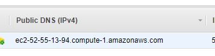

### Setup and Initial Connection

The first step to deploying a server on an AWS EC2 instance is to choose an ["Amazon Machine Image" (AMI)](https://en.wikipedia.org/wiki/Amazon_Machine_Image) (a virtual machine). A new instance can be created through the AWS EC2 service at [https://console.aws.amazon.com/ec2](https://console.aws.amazon.com/ec2/), imaged below.


*The AMI selection page*

The pem file at the end of the setup is *key* because you need it to login to the instance. The docs specify the following command for connecting to an EC2 instance remotely with the pem key as authentication:

```bash
ssh -i /path/my-key-pair.pem ec2-user@ec2-198-51-100-1.compute-1.amazonaws.com
```

From the line above, it's clear that the default username is ec2-user, while the public DNS can be found on the [AWS instance homepage](https://console.aws.amazon.com/ec2/). Mine is ec2-52-55-13-94.compute-1.amazonaws.com:



On first login, you'll get an "authenticity of host <PUBLIC_DNS(IPv4 Public IP)> can't be established", warning, which you should reply "yes" to.

### EC2 Login without PEM file

Since it can get annoying to reference the PEM file on every login, it's easiest at this point to copy your public key to the .ssh/authorized_keys file on the remote instance. If you don't have a public key, [see this](https://git-scm.com/book/en/v2/Git-on-the-Server-Generating-Your-SSH-Public-Key). This is doable by the following (with the correct substitutions to the PEM file name and public DNS): 

```bash
ssh -i AWS-login.pem ec2-user@ec2-52-55-13-94.compute-1.amazonaws.com "echo \"`cat ~/.ssh/id_rsa.pub`\" >> .ssh/authorized_keys"
```

At this point it should be possible to login without a "-i [PEM FILE NAME]" flag.
