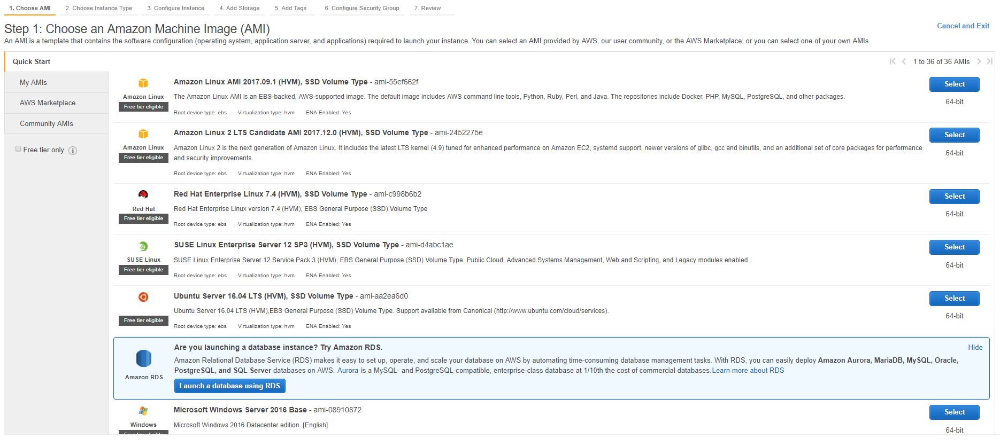

I'm building a demo application right now for a protein data base (PDB) file comparison website. I chose the project after looking for a project where I could use Golang's concurrency. A search website was ideal since each query against the server necessitates numerous fetches to multiple external API's. **This post is about getting the Golang server of the application to the cloud.**

Repo: [https://github.com/JJTimmons/goPDB](https://github.com/JJTimmons/goPDB)

### Setup and Initial Connection

The first step to deploying a server on an AWS EC2 instance is to choose an ["Amazon Machine Image" (AMI)](https://en.wikipedia.org/wiki/Amazon_Machine_Image) (a virtual machine). A new instance can be created through the AWS EC2 service at [https://console.aws.amazon.com/ec2](https://console.aws.amazon.com/ec2/), imaged below. Download the pem key, ignore the security warning (reply "y") and login to the instance.


_The AMI selection page_

### EC2 Login without PEM file

Since it can get annoying to reference the PEM file on every login, copy your public key to the .ssh/authorized_keys file on the remote instance. If you don't have a public key, [do this](https://git-scm.com/book/en/v2/Git-on-the-Server-Generating-Your-SSH-Public-Key). This is doable by the following (with the correct substitutions to the PEM file name and DNS). This saves you from logging in with "-i [PEM FILE NAME]" flag.

```bash
ssh -i AWS-login.pem ec2-user@<AWS Location> "echo \"`cat ~/.ssh/id_rsa.pub`\" >> .ssh/authorized_keys"
```

### Adding a Port

Head now to security settings which is on the left side of EC2 management console (and beneath "NETWORK & SECURITY"). There, identify the security group used on the lazy deployed instance and, under the "Outbound" tab at the bottom of the page, add a Custom TCP Rule for Inbound and Outbound traffic on port 3000.

### Installing and Configuring Golang

The following lines are enough to install Golang (and git for the dependencies) on the remote server:

```bash
sudo yum update -y
sudo yum install -y git
sudo yum install -y golang
```

After that, add the GOROOT and GOPATH to ~/.bash_profile. Mine looks like this:

```bash
# .bash_profile

# Get the aliases and functions
if [ -f ~/.bashrc ]; then
        . ~/.bashrc
fi

# User specific environment and startup programs
GOROOT=/usr/lib/golang
GOPATH=$HOME/projects

PATH=$PATH:$HOME/.local/bin:$HOME/bin:$GOROOT/bin
```

### Moving Code to Server

I keep and develop my Golang code in a local repository within a "server" folder. The following is a bash script to clear the binaries I used during development and push the code to the instance, overwriting existing files (rsync isn't available on Windows):

```bash
rm server/*.exe
scp -r ./server ec2-user@ec2-52-55-13-94.compute-1.amazonaws.com:/home/ec2-user
```

After uploading the files to a server folder on the instance, the following will build and execute the Golang server:

```bash
go run `ls server/*.go | grep -v _test.go`
```

With that, the server should be available behind the DNS and port. For me, my Golang PDB comparison API is available at: http://<AWS Location\>/:3000
