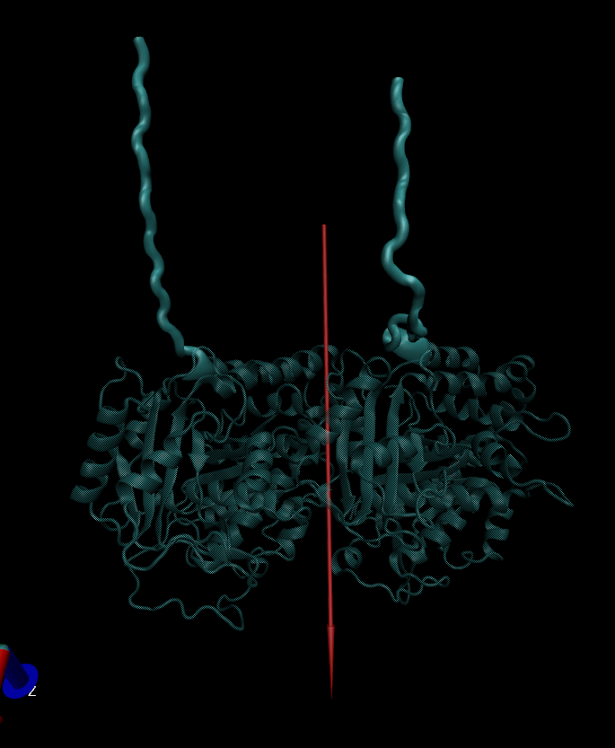
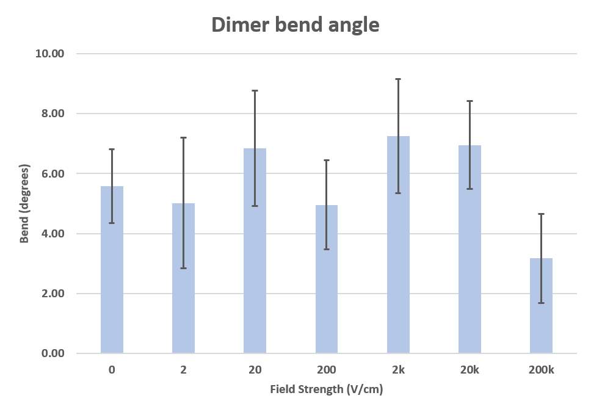

I have been doing runs with tubulin heterodimers in the presence of external
electric fields (EEFs), over a range of strengths, to see how the dimer's motion changes in response.
In all of them so far, I've started with an equilibrated tubulin with
tails (C-termini) lying flat along the surface of the dimer. They reached this position at the
end of a 50ns MD run; at the start, the tails had been extended (I added them with
[Modeller](https://salilab.org/modeller/wiki/Missing%20residues)).

Because the tails are dynamic, and the movement between an extended
and a contracted state along the dimer likely influence the movement of kinesis along
the microtubule, it seemed worthwhile to try extending them for the start of a
simulation and see what effects it might have during the run.

### Setup
The equilibrated molecule was first added to a much larger solvation box, 125x125x125Ang,
and the tails were pulled outwards using SMD between the CA of the last residue on each
tail and two water molecules outwards from the dimer. Each water molecule was chosen
for its positioning outwards from the center of dimer.
#####  The starting position of the simulation after the tails had been extended. Red arrow is dipole vector

The EEF was applied upon the direction of the dimers dipole at the start of the 
simulation (red arrow). Each run was repeated once for each field strength for 50ns.
The first 5 ns were discarded from the bar plots below.

### Results
The results of this run suggest that EEFs of sufficient strength can keep
the tails in the extended state, whereas they will contract without any EEF,
or if the EEF is insufficient (exceeding 20kV/cm). While the observation of keeping
the tails extended is, to my knowledge, new, the threshold for EEFs to have an observable
effect during an MD run is not ([English, 2015](https://www.ncbi.nlm.nih.gov/pubmed/25903011)).

#####  The tails at the end of a run with 200kV/cm, teal, versus 20kV/cm, yellow 

In an attempt to quantify the degree of "extension" by the tubulin C-termini, I
took the dot product of the normalized EEF vector and the vector formed between
the first and last CA of the C-termini. The results of this heuristic are below.
Again, nothing seems noticably different until the field exceeds 20kV/cm, afterwhich
there is a noticable increase in the degree of extension in the direction of the field.

#####  Tail extension dot product

Finally, one observation that has informed a future simulation, is the change in bend angle
of the free-floating dimer. While most the runs saw the tubulin floating around 6 degrees,
in keeping with the results observed by a PMF experiment by [Peng, 2014](http://journals.plos.org/ploscompbiol/article?id=10.1371/journal.pcbi.1003464),
the dimer exposed to 200kV/cm was noticably more linear, with a bend angle less than 4 degrees. When I have time
I'll follow up on this.

#####  The bend angle, measured between centers of H7 alpha helicies as described in [Peng, 2014](http://journals.plos.org/ploscompbiol/article?id=10.1371/journal.pcbi.1003464)

### Conclusion
It is not suprising that EEFs can keep the tails extended since they are very
negatively charged (each with, at most, -9 unit charges). Their ultimate
charge is determined by post-translational modifications, like [polyglutamylation and polyglycylation](http://www.sciencedirect.com/science/article/pii/S0960982214003248).
An extension of this simulation, pun intended, would be to increase the padding and salinity
to see whether the results are robust, even in the presence of strong dipole screening.
