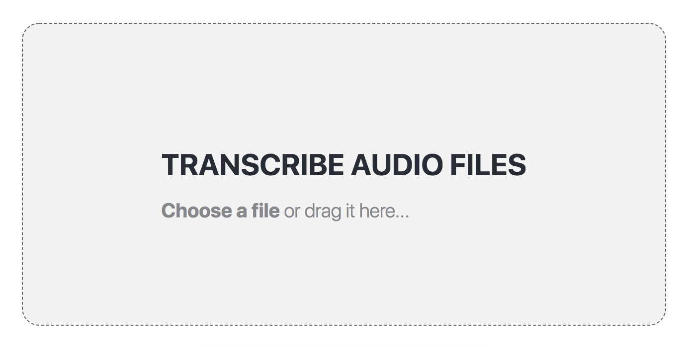
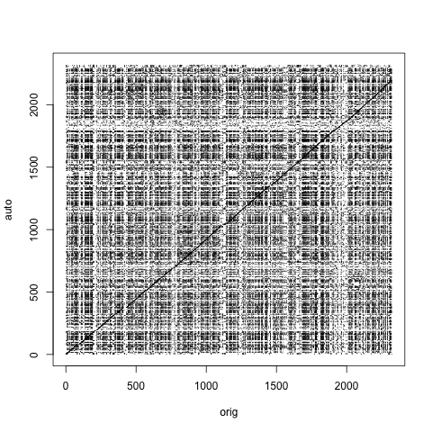

I made this site to "demo projects I've worked on." I've done no such thing (the "demo-ing," not the working on projects part). So this is a "demo-post." I did a thing, and this demoes it. Look at me -- not dead yet...

### Backstory

My SO does research with a psychology group at Northeastern. Her group works on a range of topical projects: body-images in ad campaigns, poses on Instagram, and eating disorders associated with self-perception. She's currently working on a study of "[Ortherxia](https://en.wikipedia.org/wiki/Orthorexia_nervosa)." It's an eating disorder characterized by an excessive preoccupation with healthy eating. Imagine someone that plans every day around nutrients to the point where it negatively affects the rest of their life. (I ate a chocolate Easter bunny for breakfast this morning, so I've got issues, but of a different sort.)

In her project and others, the researchers hold in-person interviews. Individuals that are within the target-research group are found through surveys (usually of undergraduates on campus), and, in recorded sessions, the interviewers/researchers try to get more information of the research subject. These surveys illuminate more than the anonymous surveys are capable, and are the backbone of many of her group's projects.

What annoys me about this is that the recorded interviews are then manually transcribed. As in, undergraduate and graduate researchers not only conduct the in-person interviews, but they then, word-for-word, translate the conversation into text. This part seems ridiculous. It's tedious, menial, and takes over an hour and a half for 30 minute interview. It's not the best use of the graduate student's time: they could be doing deep dives of the literature, data anaylsis, or complaining about their thesis advisers.

My opinion on robo-transcription is shaped by my exposure, four years ago, to the [Dragon transcription software](https://www.nuance.com/dragon.html). I used to shadow a non-invasive cardiologist at Sarasota Memorial -- I was premed and trying to complete the med-school application checkbox of "x number of hours of clinical exposure." After every appointment, the physician would return to his office, open up his patient management system, and click a large green circular button activating the Dragon software. He would then begin recording the details of his meeting with the patient into the record management system. "Patient is 56 years old, lives in Michigan during the summer, and recently fainted... period" -- he would always say "period" to end each sentence, and it's the detail I remember most when recalling those 253 odd hours shadowing. So the software wasn't great (see, "period"), but it got the job done, and that was years ago. Surely now, in the age of voice-assistants, there's an easy to way to turn audio files from in-person interviews into text automatically. No one should be doing that manually.

I've been annoying my SO by saying stuff like "that's a robot's job" for at least a year and a half. But I was driven to actually prove auto-transcription is easy to implement when I saw Google released public access to its [Speech API](https://cloud.google.com/speech/). They've made it a simple endpoint where you post an audio file and get back a transcribed text file -- it's probably the same program they use in Google Home, but for static files, rather than streaming.

To demo this, I made a web app: [github.com/JJTimmons/google-speech-to-text](https://github.com/JJTimmons/google-speech-to-text)

### Server

The web app has to do a couple things to a text file to get it ready to be transcribed. First, Google Speech only accepts a few higher-quality audio formats (see: FLAC, LINEAR16, etc). MP3 is not on that list (and it errors out if you try). So I first sent up an Ubuntu EC2 with a program called FFMPEG. I've legit never heard of [FFMPEG](https://www.ffmpeg.org/), but it's pretty incredible. Any audio file in, any audio file out. In my case I'm outputing files that follow the Google Speech api specs: 16,000 Hz, 16 bit, FLAC format, and mono-channel. It's trivial to implement (and must mean that Google didn't implement the same, because the quality of the input audio files is highly correlated with their transcription accuracy).

```bash
# actual file at: github.com/JJTimmons/google-speech-to-text/blob/master/server/src/convert.js
sudo apt-get install ffmpeg
ffmpeg <INPUT_AUDIO_FILE> -c:a flac -ar 16000 -sample_fmt s16 -ac 1 <OUTPUT_FLAC_AUDIO_FILE>
```

I then set up a connection to Google Storage. Google Speech only works with files in Google Storage, so I had to upload each file to their Google Storage/"don't-call-it-S3" endpoint first:

```javascript
// actual code at: github.com/JJTimmons/google-speech-to-text/blob/master/server/src/googleStorage.js
const Storage = require("@google-cloud/storage");
const shortid = require("shortid");

const config = require("../config.js");

const storage = Storage({
  projectId: config.GCLOUD_PROJECT
});
const bucket = storage.bucket(config.CLOUD_BUCKET);

function getURL(filename) {
  const uri = filename.replace(/\.\//, "");
  return `gs://${config.CLOUD_BUCKET}/${uri}`;
}

module.exports.upload = filename => {
  return new Promise((resolve, reject) => {
    // some random id for file
    bucket
      .upload(filename)
      .then(() => resolve(getURL(filename)))
      .catch(err => reject(err));
  });
};
```

I then hit the Google Speech API endpoint, telling it about the audio file that's in Google Storage, and wait for a response. The response object is actually an array of an array of strings. At each "sentence" (I don't know how Google qualifies a cut-point), the API returns a list of possible transcriptions for the speech, as well as a list of their possible values. By taking the first of each, we're just taking the most-likely text response for each sentence.

```javascript
// actual code at: github.com/JJTimmons/google-speech-to-text/blob/master/server/src/transcribe.js

const path = require("path")
const KEY_PATH = path.join(__dirname, "..", "keys.json")
process.env.GOOGLE_APPLICATION_CREDENTIALS = KEY_PATH;

// Imports the Google Cloud client library
const speech = require("@google-cloud/speech");
const fs = require("fs");

// Creates a client
const client = new speech.SpeechClient();

module.exports = (jobID, gcsUri) => {
  const config = {
    encoding: "FLAC",
    sampleRateHertz: 16000,
    languageCode: "en-US"
  };

  const audio = {
    uri: gcsUri
  };

  const request = {
    config: config,
    audio: audio
  };

  // Detects speech in the audio file. This creates a recognition job that you
  // can wait for now, or get its result later.
  return client
    .longRunningRecognize(request)
    .then(data => {
      const operation = data[0];
      // Get a Promise representation of the final result of the job
      return operation.promise();
    })
    .then(data => {
      const response = data[0];
      const transcription = response.results
        .map(result => result.alternatives[0].transcript)
        .join("");
      fs.writeFileSync(`${jobID}.txt`, transcription, { encoding: "utf8" }); //save to local file system
    })
    .catch(err => {
      console.error("ERROR:", err);
    });
};
```

I'm writing files to the server because the transcription server takes a long time -- up to 5 minutes for a 15 minute speech. So I have the client poll the server once every 15 seconds. The server then checks whether it's written a record with the queried id, and returns it if so. Otherwise, if the converted audio file is still in the directory, tell the client to keep polling.

```javascript
/**
 * source: github.com/JJTimmons/google-speech-to-text/blob/master/server/src/index.js
 * check whether 1) the file is still being converted (the FLAC file exists)
 * 2) the file is not being converted (bad request or failed)
 * 3) the file has successfully been translated, return the transcript and delete
 * the converted file
 */
app.use("/results", async (req, res) => {
  const jobID = req.body.jobID;

  const flacPath = `${jobID}.FLAC`; // name of converted file
  const transcriptPath = `${jobID}.txt`; // transcript path

  const transcriptFileExists = fs.existsSync(transcriptPath); // transcribed
  const flacFileExists = fs.existsSync(flacPath); // still in storage. transcribing
  if (transcriptFileExists) {
    return res.status(200).send({
      transcript: fs.readFileSync(transcriptPath, { encoding: "utf8" })
    });
    cleanUp(jobID);
  } else if (flacFileExists) {
    return res.status(202).send({ message: "Transcribing..." });
  } else {
    return res.status(404).send({ message: "Transcription failed..." });
  }
});
```

### Client

I used a basic React frontend, made with Create-React-App, and deployed the static build to S3. It's minimal but allows DnD of audio files and has a small visual indiciation that the results are transcribing. I'm not going to post an endpoint because I'm paying for the Google Storage bucket and Google Speech service on a per-usage basis, so the tool's really just for my SO right now.


_The front end of the transcription application. Drag and drop or select an */audio input file_

### Wrapping up

Will this app help my SO? Probably not. She's under a pretty strict [IRB](https://en.wikipedia.org/wiki/Institutional_review_board) for her studies. I don't think she'll be allowed to upload interviews, about sensative mental-health issues, to the internet to test out my whiz-bang app. All the major cloud companies are [HIPPA compliant](https://cloud.google.com/security/compliance/hipaa/), and could probably be used, but I don't think it's in the current IRB contact, and I doubt they'll pursue an amendment.

Could this app be improved? Yes, in a couple ways. First, there could be much better UI feedback on the state of the transcription. For example, I could create a regression for estimating how long it will take to transcripe an audio file -- given its format and length. This could be displayed to the user as a pseudo-loading bar. I could also show the transcription in the browser afterwards and allow them to scroll thru the audio file, seeing the transcription text above the audio file as it progresses (fixing it where it's wrong, before downloading it). I could also have the user pay to create their own Google Storage bucket, so I could make the app public and not worry about a massive Google Cloud bill. But the interesting tech is in the transcription program itself, so that's not really worthwhile.

Takeaways from building the app include that Google's Cloud Services are very convenient. I think the UX is superior to AWS by a long-shot. The primary benefit I see is that efforts can be grouped by project in Google, whereas in AWS, in the S3 panel, you get a list of every bucket under the sun and your account. This seems like a large advantage but companies with lots of applications. I also liked Google's efforts in making their services easily excessible through npm packages. Both the Google Storage and Google Speech packages were dead simple, and I haven't seem anything that trivial from AWS (all my interactions with AWS have been thround their CLI). Also, finally, Create-React-App is a god-send. 10/10 would build demo app with again.


_Word by word transcription alignment plot_

This is an alignment plot I created between a manual and automatic transcription of a political speech, labelled "orig" and "auto," respectively. It's based on sequence alignment plots used in genetics and shows pretty clearly the near-exact overlap between the two transcriptions. It does look like Google's Speech API is adding additional words that the human didn't add (maybe splitting compound words into two) -- the lossy MP3 audio format may be to blame. The results are still overlapping enough to where I think this is a valuable first-line-of-attack to audio transcription.
