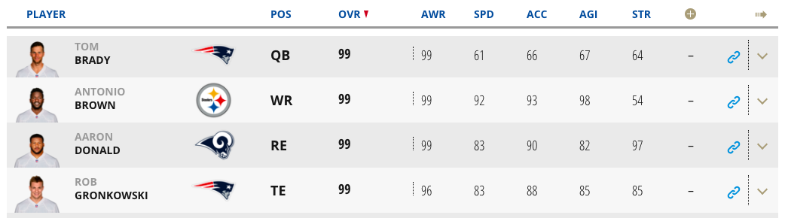

In search of a project for R, I've started fantasy football forecasting. I binge on FF already -- spending hundreds of hours per season on leagues with payouts in the hundreds of dollars. I might as well learn something.

My goals are to 1) predict player's fantasy points for the upcoming season and 2) create a draft ranking using the standard value-over-replacement.

Github repo: [https://github.com/JJTimmons/ff](https://github.com/JJTimmons/ff)

## Scraping and cleaning

My repo is setup with just a few folders right now: data (immutable), analysis (scripts), and output (eg images for this post).

For input data in these early models, I'm using [pro-football-reference]("https://www.pro-football-reference.com"). They have decades worth of fantasy football stats (last year's: [https://www.pro-football-reference.com/years/2017/fantasy.htm](https://www.pro-football-reference.com/years/2017/fantasy.htm)).

```r
scrape_year <- function(year) {
  url <- paste0("https://www.pro-football-reference.com/years/", year, "/fantasy.htm")
  page <- read_html(url)

  player_table <- page %>%
    html_nodes("#fantasy") %>%
    html_table()
  player_table <- player_table[[1]] # only one per page

  headers <- player_table[1,] # first row is headers
  headers[2] <- "Name" # blank by default
  colnames(player_table) <- headers # set headers
  player_table <- player_table[nchar(player_table$Name) > 1, ] # remove title rows
  player_table <- data.frame(player_table)

  player_table$Year <- rep(year, nrow(player_table)) # set year in the Year column
  player_table
}

FIRST_YEAR <- 1997
LAST_YEAR <- 2017
player.data <- lapply(seq(from=FIRST_YEAR, to=LAST_YEAR), scrape_year)
player.data <- do.call(rbind, player.data) # https://www.r-bloggers.com/concatenating-a-list-of-data-frames/
save(player.data, file = paste0("player_data.raw.Rda"))
```

After some cleaning and type setting (not shown), the data was ready for basic modeling.

## Panel data and plm

I spent a couple days unsure about how to go about forecasting. At first I created a basic for loop that simply lagged the each player's fantasy points, but I was unclear on how to create regressions.

It would have been trivial had every player played the same seasons (ie if the data-set had been "balanced," a new word for me). But the players, of course, didn't play for the same season. I scraped 20 years of fantasy data, and the average running back's career is just [2.5 years](https://www.statista.com/statistics/240102/average-player-career-length-in-the-national-football-league/). An aside: the longest NFL career in history was 26 seasons -- it was [George Blanda's](https://www.sports-management-degrees.com/10-of-the-oldest-players-in-nfl-history/). He was also the oldest person to have played in the NFL (he retired at 48!).

What I needed was a way to regress fantasy points scored on lagged covariates in an apples vs apples way across time. Some [course notes](<(https://www.princeton.edu/~otorres/Panel101R.pdf)>) had the name for this type of data-set:

> Panel data (also known as longitudinal or cross-sectional time-series data) is a dataset in which the behavior of entities are observed across time.

This data type fits fantasy football stats perfectly and, because of that, I settled on [R's plm package](https://cran.r-project.org/web/packages/plm/plm.pdf). After converting the data to a pseries object I was ready to create regressions by position. An example for quarterbacks:

```r
setwd("~/Documents/GitHub/ff/analysis")
load("~/Documents/GitHub/ff/data/player_data.Rda")

# only a decade's worth of data
player.data <- player.data[player.data$year >= 2007,]
player.data <- pdata.frame(player.data, index=c("name","year"), drop.index=FALSE, row.names=TRUE)
player.data <- split(player.data, player.data$fantpos)

qb.data <- player.data[["QB"]]
qb.formula <- formula(fantpt ~ lag(fantpt) + age)
qb.model <- plm(qb.formula, data = qb.data, index = c("name","year"), model="pooling")
summary(qb.model)

# for each player in the data set
qb.coors <- data.frame(x=numeric(0), y=numeric(0))
med.pts <- median(qb.data$fantpt, na.rm = TRUE)
for (name in unique(qb.data$name)[1:30]) {
  player <- qb.data[qb.data$name == name, ]

  for (i in 1:nrow(player)) {
    # if there's no data on player last year, skip
    if (i-1 < 1) next

    player.now <- player[i,]
    lag1 <- player[i-1, "fantpt"]

    qb.coors <- rbind(
       qb.coors,
       list(
          x = sum(c(1, lag1, player.now$age) * qb.model$coefficients, na.rm = TRUE),
          y = player[i+1,"fantpt"]
       )
    )
  }
}

# only keep the cases where we know next season's score
qb.coors <- qb.coors[complete.cases(qb.coors),]

# calculate R-squared
total <- with(qb.coors, sum((y - mean(y))^2))
var <- with(qb.coors, sum((y - x)^2))
qb.rsqrd <- round(1 - (var / total), digits = 3)
qb.rsqrd <- paste0("R^2 = ", qb.rsqrd)
qb.rsqrd
```

Unfortunately, given the weekend, I wasn't able to find any model (for QBs, RBs, WRs, and TEs) that did better than a simple regression on lagged fantasy points and age -- and age had a very small effect. In other words, by far the best predictor for next year's points was last year's points.

```
Coefficients for QB model:
             Estimate Std. Error t-value  Pr(>|t|)
(Intercept) 73.238273  24.619189  2.9748  0.003073 **
lag(fantpt)  0.744202   0.031641 23.5200 < 2.2e-16 ***
age         -1.419620   0.847950 -1.6742  0.094722 .
---
Signif. codes:  0 ‘***’ 0.001 ‘**’ 0.01 ‘*’ 0.05 ‘.’ 0.1 ‘ ’ 1
```

An obvious negative to this kind of prediction is that it narrows the model's applicability to players with a previous year's data to reference. So newly drafted players won't show up at all. I tried a step-wise function, where I imputed the median for a rookie player into the previous years results, but it negatively affected the R-squared of every position.

The model is also biased in that we're only regressing data from players that played in the "next" season. For example, players that had bad seasons -- perhaps those ended by season-ending injuries -- are underrepresented in the model, which I think is part of the reason the expected pts coefficient is so high for all of the models.


## Future

The models are uber-simplistic. Given that their predictive power comes duplicating what the player got the year before, they are hardely useful. But it's also just a first draft approach. In the future, I'll try to incorporate additional information.

The easiest approach would be to incorporate "expert opinions" -- adding in draft predictions from ESPN, NFL, CBS, etc. This is the most conventional approach (see: [fantasyfootballnerd.com](https://www.fantasyfootballnerd.com/), [fantasyfootballanalytics.net](https://fantasyfootballanalytics.net/), [fantasypros.com](https://www.fantasypros.com/)) and is also the most robust, according to [Fantasy Football Analytics](http://fantasyfootballanalytics.net/2017/03/best-fantasy-football-projections-2017.html). This makes sense, since the results of accumulating everyone's predictions is something like that of a meta-analysis.



Another approach, that I haven't seen anyone do, would be to add in meta from [Madden](https://www.easports.com/madden-nfl/player-ratings?i=1&t=32&s=ovr_rating:DESC&=undefined) to see if their player stats (like skill primitives) are enough to help predict outcome. Or maybe Madden stats plus expert ratings... To be continued.
