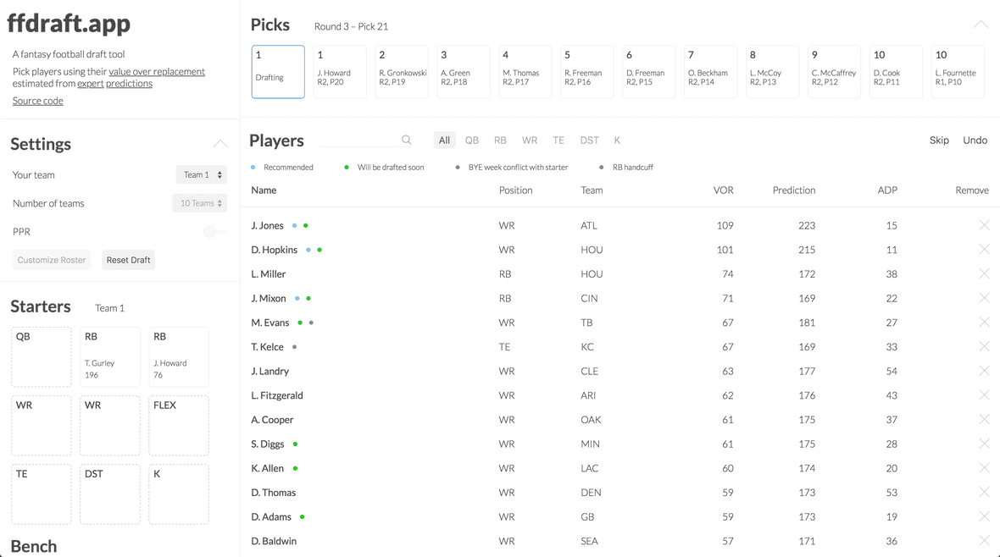

app: [https://www.ffdraft.app/](https://www.ffdraft.app/)

code: [https://github.com/JJTimmons/ff](https://github.com/JJTimmons/ff)

This week I wrapped up my fantasy draft app. It’s the end of my fantasy football project, and it’s done for two reasons. Firstly, I’m running out of useful features to add, and secondly — and more importantly — the draft season is over. Starting next week, the app will be on ice for another 50 weeks or so...

## Stack

I built the app by bootstrapping create-react-app-typescript. I went with Typescript because I wanted to learn and try something new. It wound up being the best part of the project. If I could easily redo all my former Flow projects in Typescript, I would.

Typescript is (in my opinion) way better for React than Flow. An easy example of the difference is in the handling or refs. With Flow, refs are a pain. I wind up trying all derivations of `React.Ref<React.Element<'div'>>` until the majority of the red errors go away (and I still haven’t found a way to avoid the errors like “current does not existing on this object”). In Typescript, by comparison, the solution is 1) well documented, 2) auto-recommended by VSCode, and 3) much easier to look at: React.Ref<HTMLDivElement>.

Others think that Flow has better support for React, and, to be honest, I didn’t go too far down the rabbit-hole with auto-injecting props into HOCs or anything like that. But, for the size and scope of the SPA I was trying to build here, Typescript with React was truly enjoyable.

## Scope

The goal of the app is to help draft players by ranking them accoring to their value over replacement. That is, their value relative to other players in their same position. It’s the best way I know to compare one position to another and maximize a team’s total points each week. In the end I think I achieved that limited goal and have made a tool for myself that’s better than any alternative.

### Alternatives

- FantasyFootballAnalytics is an interactive and very detailed app that was a huge influence, but it’s build with RShiny and is consistently slow and clunky
- FantasyPros Draft Wizard is a clean app and takes the same underlying approach that I do — wisdom-of-the-crowd from expert rankers — but it’s $10 and involves a subscription
- BeerSheets is huge on Reddit but is a spreadsheet and the model underlying it is “secret” (see: same or worse than averaging expert predictions)
- Draft Aid is a front-end for the “tier-based” data that’s almost as popular on Reddit as Beersheets. But I don’t agree with clustering as a useful approach to drafting (like, at all). I think Reddit’s hive-mind got distracted by some good-looking graphs.

### FFDraft.app features

The app that I built does what I need it to do, which is 1) keep track of player rankings throughout the draft and 2) tell me who to draft. I got it there by adding these features:

- Ranks players by the expert-prediction-averaged VOR
- Single-click on players to draft them to whichever team is drafting
- Grays out players in positions already filled on the user’s roster
- Customizable rosters (ex: 2QB-leagues) with dynamic VOR calculations
- Auto-recommends who to draft next, based on VOR, filled-positions, average-draft-position (ADP), and roster settings
- Highlights players with bye-week conflicts or that will be picked soon (by ADP)
- Filter players by position or name
- Draft controls (for keeping up with the draft)
- Remove players manually
- Skip + undo draft picks
- Drag picks ontop one another to swap them
- Mobile support (pared down version of the app)
- Standard or PPR scoring

## “Marketing”

I had a working prototype done a couple weeks ago. Since I was excited and thought it was going to be popular (given the dearth of alternatives), I rushed to two subreddits to share the news: r/fantasyfootball and r/Fantasy_Football. I got very little attention. Or less that I was expecting. A dozen or so people replied to my comments/posts. 10% were excited and said “bookmarking this for later!,” while 90% said “this is great, but can you do X?” So I started building X and X+1. Newly added features included the custom roster feature and filtering by name. The app improved because of the Reddit comments, and I tried to message back to all feature-requesters after I’d finished their requests.

The “big break” came the day after I moved the app to ffdraft.app. There was a new post in r/fantasyfootball titled “Monday Draft Guide Giveaway!” It was some scammy excel-spreadsheet model that ff redditors flocked to when it was being given away for free (which was once a week). I snarkily commented with something like “if you don’t get picked by their lottery, check out my free app — it’s better than a spreadsheet.” Their post (and “giveaway”) did awesomely and rose to the top of the subreddit, with my trash-talking comment as the highest voted in the thread. I got ~1.95k that day. Many of them were on mobile, and the average session-duration was just at ~35 seconds, but it was a great feeling watching the stats on Google Analytics.

That lead to a bunch of feedback from a deluge of commenters which kept me busy for another week. I added more features (the Pick tracking row, with it’s DnD interface, for example) and spent less time on “marketing.” Overall it was a newish experience for me (trying to promote something I made). I wouldn’t qualify 2.6k total visitors as a success, but I’ll give it one more shot next year — particularly if there are any repeat users.

## Future

There are some features that I didn’t implement for lack of time. I'll try to add them next year. They — and my conservative time-estimates for making them — are:

1. Auto draft-syncing (2 weeks)
2. Custom data upload (ex: Beersheets) (2 weeks)
3. Graphical exploration of the predictions (1 week)
4. Dynasty/fixed-roster drafting (0.5 weeks)
5. Custom draft ordering (0.5 weeks)
6. Warnings about injuries (2 days)
7. Persistent state (localStorage) (1 day)
