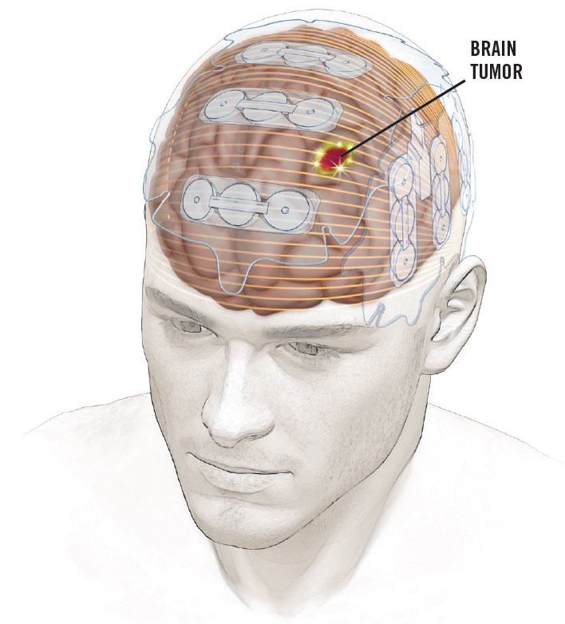
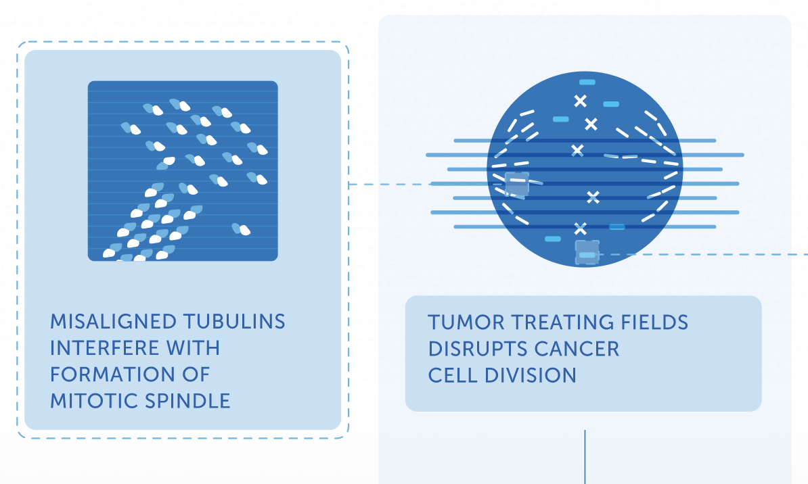
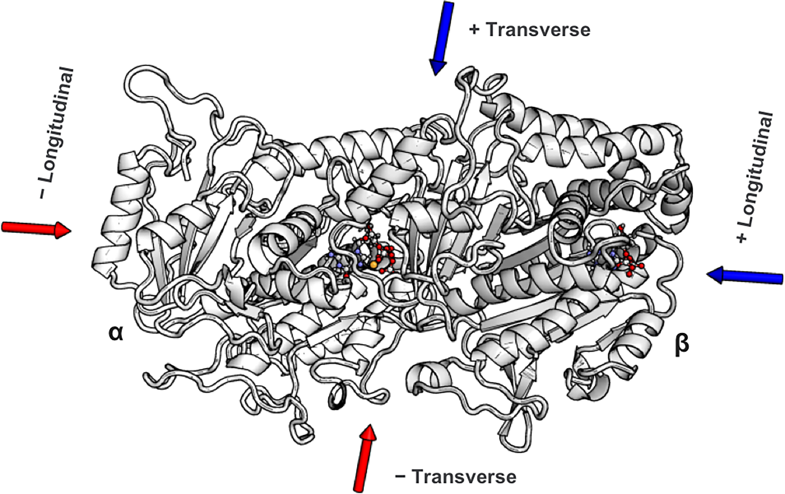
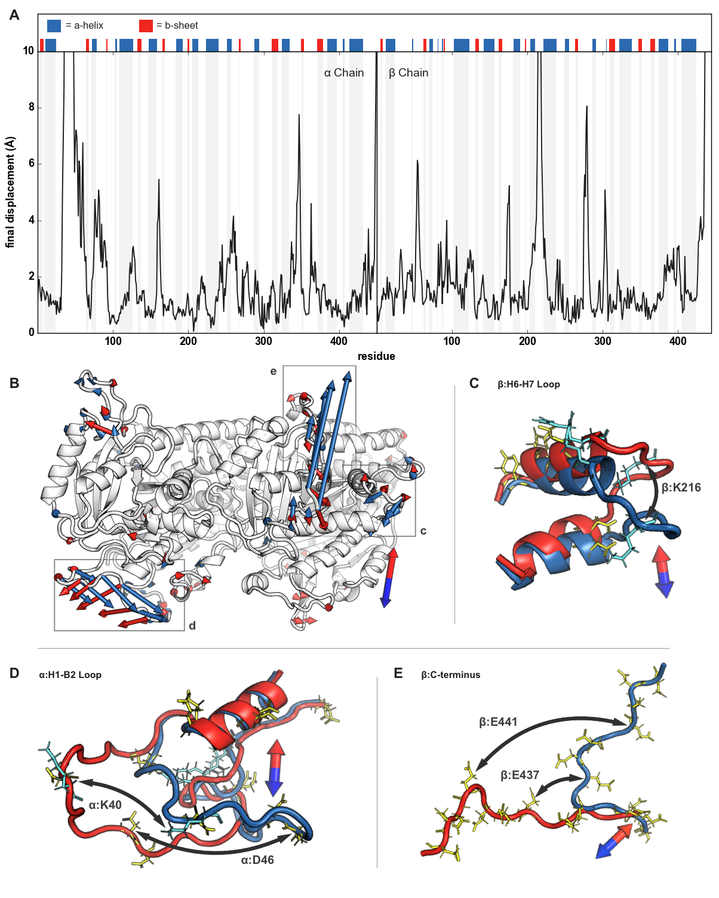
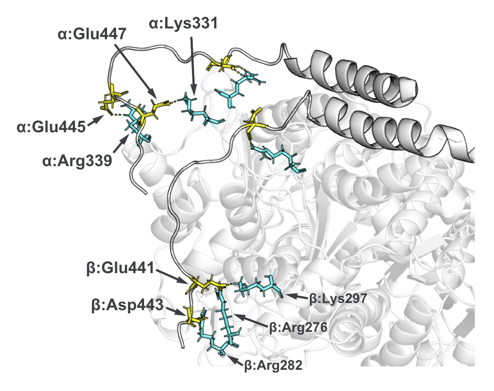

Paper: [https://journals.plos.org/plosone/article?id=10.1371/journal.pone.0202141](https://journals.plos.org/plosone/article?id=10.1371/journal.pone.0202141)

My great-uncle died of Glioblastoma shortly before I started college. I was surprised because he didn't match the type of person that would die of cancer. He was young, a long distance runner in Denver, a Cornell graduate and lawyer. As the first of my immediate family in Florida to go to college, I was often compared to him by my grandmother. The timing and unexpectedness of his death inspired my interest in medicine as a career, and two years later I joined a neuro-oncology research group at Beth Israel Deaconess Medical Center.

One of the group's primary focuses was on Tumor Treating Fields (TTFields). Hailed as a [breakthrough in 2014](https://www.nytimes.com/2014/11/16/health/electrical-scalp-device-can-slow-progression-of-deadly-brain-tumors.html), these low dosage electric fields were shown to improve the life expectancy of Glioblastoma patients. They are an anomaly. They don't fit within other cancer treatment modalities. Surgeons [cut](https://en.wikipedia.org/wiki/Radical_mastectomy) with surgery; physicians [poison](https://en.wikipedia.org/wiki/Sidney_Farber) with chemotherapy; physicists [shoot](https://en.wikipedia.org/wiki/Niels_Ryberg_Finsen) high energy particles with radiation. More recently, physicians have began using [immunotherapies](https://www.mdanderson.org/publications/conquest/immunotherapy-innovator-jim-allisons-nobel-purpose.h36-1592202.html) to release the cytotoxic, attack-dog like immune cells within us. TTFields are tame by comparison.

_TTField setup_

Patients wear the battery-operated NovoTTF for 18 hours a day, during which it continually zaps the tumor via electric fields. Other than rashes, there are no known side-effects. And the fields are weak: only 2-3 V/cm. The non-invasive and non-destructive qualities make this treatment an anomaly.

## Background

In [this TED talk](https://www.ted.com/talks/bill_doyle_treating_cancer_with_electric_fields?language=en) from 2011, Bill Doyle, Director of the company that manufactures the NovoTTF device, describes TTFields and how they work. He resorts to the company's go-to explanation: "It acts on those highly charged proteins [tubulin] and aligns them. And it prevents them from forming those chains, those mitotic spindles, that are necessary to pull the genetic material into the daughter cells."

 _TTFields' proposed mechanism of action_

The idea is that those tubulin dimers, charged dumbbell-looking proteins, get caught in the electric field and can't align properly to form their microtubules. It is as if TTFields are a hurricane preventing planes from landing on a runway. This was the best existing mechanism for explaining TTFields' effects for a decade, and it's still on [the company's website](https://www.novocure.com/mechanism-of-action/) today. It's based on a couple of facts:

- Tubulin dimers have a large negative surface charge (~-22)
- Tubulin dimers have an extraordinarily high dipole (charge separation) compared to similarly-sized proteins

I don't have a biophysics background, but that explanation always sounded wrong, like a scientific-sounding explanation that a PR person stuck with because it was easier than admitting to patients and the FDA, "the mechanism is under study, we'll know more in 10 years."

There are (at least) two reasons to doubt the TTFields-rotate-tubulin story:

- There are tons of other highly charged proteins involved in cell division. My group alone published a paper linking TTFields to [Septin](https://journals.plos.org/plosone/article?id=10.1371/journal.pone.0125269), a protein with an even greater dipole
- A physics-based group lead by Dr. Tuszynski of the University of Alberta estimated that a tubulin dimer in a cell exposed to TTFields would experience an additive force roughly [four thousandths](https://www.mdpi.com/1660-4601/13/11/1128) that of random thermal energy

Dr. Tuszynski's [physics review](https://www.mdpi.com/1660-4601/13/11/1128) was of particular interest to me when I read it in 2017 -- it seemed like the first time someone had called out the TTFields-rotate-tubulin hypothesis. In large part because of it, I decided to try to model the physical interaction between TTFields and tubulin in silico. I wanted to find out, once and for all, whether an electric field could rotate a tubulin dimer.

## Approach

My approach was to use molecular dynamics: an atomic level physics simulation of the protein. A professor from the University of Illinois Urbana-Champaign called molecular dynamics "computational microscopy," and that's exactly what I thought I needed. I wanted to see whether or not the tubulin dimer was able to dock with a microtubule in an electric field.

### Roadblocks

I discovered, very slowly, that wasn't possible. It comes down to compute speed because:

1. Tubulin is a large protein with >10,000 atoms. Add water and salt and you're looking at a 140,000 atom bounding box for a single tubulin dimer. Simulated binding to a growing microtubule (100s of tubulin dimers) was completely infeasible.
2. TTFields have a frequency of 150kHz, meaning that they change direction about every 7 microseconds. Microsecond-long protein simulations are the things of [Nature papers](https://www.nature.com/articles/nchem.2785) and require purpose-built GPU supercomputers. My desktop had a nice new Ryzen CPU and a 1080 GPU, but if I had started the simulation I had in mind back in 2017 and left it running non-stop until today, I'd be less than a thousandth of the way through the simulation (and very out of storage).

### Adjustment

I gave up on trying to prove or disprove the TTFields-rotate-tubulin hypothesis. I know that's what this post has been about, but that's only because it's what led me to try a molecular dynamics study in the first place. As a final note on the TTFields-rotate-tubulin topic: it's still an interesting field of study and I'm betting that TTFields' mechanism is actually caused by intra-membrane diffusion of charged [membrane (causing pores)](https://www.nature.com/articles/s41420-018-0130-x) and disruption of [ionic currents](https://www.ncbi.nlm.nih.gov/pubmed/21604102) (salt waves along the microtubules).

Instead of looking at models on the scale of microtubules or timescales of TTFields, I pivoted to look at an adjacent and more studiable electric field therapy: nano-second pulsed electric fields. In particular, there was another [2017 paper](https://www.nature.com/articles/srep41267) investigating the effects of nano-second pulsed electric fields on Glioblastoma cells. They found that 10 nanosecond pulses at 44 kV/cm were sufficient to disturb microtubule formation. I was ecstatic to find this paper for a few reasons:

1. It still related to Glioblastoma, so it fit within the scope of my research group's focus,
2. The timescale was tens of nanoseconds which was obtainable via molecular dynamics and a 140,000 atom simulation,
3. The field strength was large enough to where its effects would be apparent within the timescale of a single pulse.

The third point was a big one because I had found in preliminary modeling that, within ~10-15 nanoseconds, the tubulin dimers structure does not change unless the electric field was on the order of 100 kV/cm. Again, it wasn't the question I'd set out to investigate, but I was happy that it still involved molecular dynamics, Glioblastoma, and electric fields.

## Investigation

The questions I tried to answer through simulation were:

1. How does tubulin's structure change in the electric fields presence?
2. Is there any movement in the tubulin dimer that could help explain nanosecond-pulsed electric fields' ability to enact microtubule breakdown?

My simulations all started with a single tubulin heterodimer (below) embedded in an explicit solvent box of water and salt. I then applied external electric fields of varying strengths using NAMD's external [electric field's module](https://www.ks.uiuc.edu/Research/namd/2.10b1/ug/node42.html). The hardest open-ended question was determining how to quantify the fields' effects on the protein structure. It seems straightforward, but distinguishing typical protein dynamics from electric field induced changes was non-trivial. The approach I wound up taking was an analysis that was based on a 2015 Science paper: [Electric-field-stimulated protein mechanics](https://www.nature.com/articles/nature20571). In it, Hekstra et al. studied the changing shape of X-ray-bombarded proteins over time. While the technique was totally different from my simulated one, I went with a similar approach where I compared two final "frames" after an application of the field in opposite directions. The figure illustrates this approach. I applied fields in opposite directions along the long-axis and short-axis of the dimer, and, after a 10ns pulse (mirroring the 2017 nanosecond-pulsed electric field paper), I looked at how the protein's amino-acids had shifted. This is the "displacement" y-axis of the figure down below.

_Setup of the tubulin dimer in the electric fields_

The quick summary of [my paper's results](https://journals.plos.org/plosone/article?id=10.1371/journal.pone.0202141) was that there are some highly charged protein loops and C-termini on the dimer's exterior that are buffeted about in the fields. Their movement is proportional to the fields' strength and direction and could, I proposed, account for microtubule breakdown. The loops have esoteric names like the "alpha H1-B2" loop, indicating the stretch of amino acids between the first alpha helix and the second beta sheet in the alpha dimer. These loops are essential for the dimer-dimer connections that make up higher-order microtubules. Several of the loops have multiple exposed charged amino acids (sidechains colored below with yellow and cyan) I think these charged loops are manipulated from strong electric fields to such an extent that typical dimer to dimer binding is inhibited.

_Amino acid displacement and loop position after application of fields of opposite directions. Several loops and the C-termini were greatly displaced._

There was also some macro-level dimer bending (Figure 7) when the field was applied along a particular axis of the protein. In-depth cryo-EM papers have found that bending in the dimer prevents inclusion of tubulin dimers into growing microtubules. It could be possible that the electric field bends the dimers ever so slightly, decreasing the growth rate of microtubules and increasing the likelihood of an avalanche-like disassembly of existing microtubules.

_Tubulin C-termini_

Finally, an interesting story that I ran out of time to look further into was the dimer's C-termini. These long uninhibited appendages are important for things like cell trafficking. They're extremely negatively charged -- as much as -9C per C-terminus. And they have an incredible range of motion around the dimer. In my simulations, the C-termini laid relatively flat along the surface of the dimer (the figure above shows the salt-bridges formed with positively charge surface residues). But the negativeness of the termini is modulated in vivo with differing glycosylation patterns. It may be that they're actually less glued to the dimer's surface than my model presented, and that electric fields bias them towards one orientation or the other, preventing their typical dynamics. I used explicit solvent (individual atoms) for the model I presented in the paper, but much longer timescales could be reached with an implicit solvent.

## Help from Others

Early in the modeling I felt way out of my league. The learning curve for molecular dynamics, [NAMD](http://www.ks.uiuc.edu/Research/namd/), [VMD](https://www.ks.uiuc.edu/Research/vmd/), and the scripting language [Tcl](https://www.ks.uiuc.edu/Research/vmd/script_library/) were significant. And I was so busy learning the molecular dynamics tech stack that I was afraid I'd miss some significant background information that would render the whole study moot.

I was lucky to be invited to several meetings with Kris Carlson, a COMSOL expert who's interested in a very similar problem and approach. He's currently [going much deeper](http://cancerres.aacrjournals.org/content/78/13_Supplement/3209.short) on the investigation into the macroscopic level effects of TTFields on microtubules and C-termini, and I believe that his modeling will yield much more information into the problem space.

At Kris' suggestion, I reached out to [Dr. Tuszynski](https://apcari.ca/meet-the-team/jack-tuszynski-research-group/) (mentioned above). He and one of his post-docs, [Jordane Preto](https://scholar.google.fr/citations?user=yQjU2AYAAAAJ&hl=fr), the last author on that physics-based TTField [review](https://www.mdpi.com/1660-4601/13/11/1128), were incredibly generous and immediately willing to help by advising on the project. I'd never met them in person, but they were still willing to speak with me over weekly Skype calls to review the project's approach and preliminary results. Jordane provided example bash scripts and, incredibly, they helped set me up with a user account for the University of Toronto's supercomputer. Their background knowledge of the literature and modeling was invaluable.
