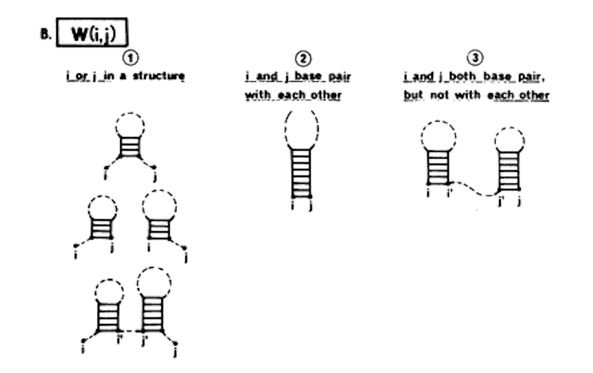

This is a post about a tool I wrote called `seqfold`. `seqfold` if a python utility library that takes in DNA or RNA sequences and predicts their "minimum free energy" -- the most likely secondary structure of the DNA/RNA, i.e. how it will fold up on itself. I wrote it at Lattice after getting tired of software like `Primer3` and `unafold` -- both had licenses that weren't friendly.

The post covers why I wrote it, what it does, and how it works.

### DNA Assembly

When I was at Lattice Automation, I wrote a bunch of applications for molecular biologists. They common thread between them was "DNA assembly." The tools creates plans for sticking DNA together in a lab.

Some industry molecular biologists make a living off genetic tricks -- tinkering with the genetics of bacteria, yeast, or plants -- to try to produce something of monetary value. For example:

- making bacteria factories for commercially valuable enzymes
- compelling yeast to spit out large antibodies for chemo
- fooling plants into making heat-shock proteins to survive drought-prone environments

To experiment with the above, biologists need to make a whole bunch of genetic constructs. And, despite [Moore's-law-esque improvements](https://www.npr.org/sections/health-shots/2019/09/24/762834987/as-made-to-order-dna-gets-cheaper-keeping-it-out-of-the-wrong-hands-gets-harder) in DNA synthesis over the years, DNA assembly is still incredibly expensive and error-prone. If a biologist wants to experiment with 2,000 specific variations of a protein sequence, for example, it's too costly to order 2,000 separate sequences from a synthesis provider like Twist (costs of a single run would approach \$1M).

So I'd work with Lattice customers to create applications that would decompose target DNA sequences into smaller fragments. Biologists in a lab would then stick them together, doing some of the DNA assembly themselves to reduce the costs relative to ordering from a synthesis provider.

### DNA "folding"

One thing about DNA assembly software is that it has to produce DNA that... assembles. That means that the DNA fragments can't glob up like balls of string.

This is especially important for [PCR primers](https://en.wikipedia.org/wiki/Polymerase_chain_reaction): the little single-stranded sequences of DNA that anneal to the ends of DNA fragments initiating the PCR amplification process. If the primers ball up (on themselves or each other), the DNA won't amplify, or it will amplify unexpected sequences and the plasmid product won't match what the biologist had in mind.

When making PCR primers, the DNA assembly software needs to know in advance which sequences of DNA sequence will fold-up on themselves and avoid the those sequences like the plague.

The way this prediction happens is via simulated DNA folding. Software takes the 1D DNA sequence in and spits out a 2D structure of the DNA after it's begun to self-anneal. For example, in DNA, cytosine (C) binds to guanine (G) via three hydrogen bonds. If short 20 basepair DNA sequence begins with a "GG" and ends with "CC", it's likely that those basepairs will anneal to one another in a "GG/CC" basepair. In an extreme example, a sequence of DNA might be a perfect match for itself. For example, it might have a sequence of "AAGGCCTT". Such a sequence would perfectly pair with itself in a dimer like "AAGGCCTT/TTCCGGAA" -- "AAGGCCTT" would make for a terrible PCR primer and DNA assembly software has to avoid it.

### Existing Software

The most prevalent tools for DNA folding were `Primer3` and `Unafold`. I wasn't crazy about either.

`Primer3` is the industry standard primer-design tool. It takes in sequences of DNA and creates DNA primers for PCR. Creating good PCR-primers is a multi-objective optimization problem, and one of those objectives was, as described above, avoiding DNA that folds up on itself. So, internally, `Primer3` will attempt to predict whether the DNA sequence will fold. Unfortunately, this fold-prediction was really basic. It just checked whether there was a high Tm (melting temperature) of the primer against sub-sequences of the target and primer sequences. It didn't account for non-trivial DNA folding that could also make for bad primers (eg bifurcated hairpins). Also the license wasn't great for DNA assembly tools for industry customers (GNU).

`Unafold` was the other alternative, but it wasn't ideal for DNA assembly either: it had a copy-left, commercial license with industry fees starting of around \$30K.

### Creating a "New" Library

Fortunately, there were a series of papers between the late 70s and early 90s that covered the tips and tricks of software for folding nucleic acids. Researchers back then were interested in predicting how virus sequences would fold, but their approach was equally applicable to DNA.

When I wrote the `seqfold` library, I just followed the footsteps laid out in those papers. The following was the chief blueprint:

> Zuker, Michael, and Patrick Stiegler. "Optimal computer folding of large RNA sequences using thermodynamics and auxiliary information." Nucleic acids research 9.1 (1981): 133-148.



#### Algorithm

In the paper above, the authors described a dynamic programming-based approach to iteratively build up a matrix of free energy deltas (ddg's) which, with a traceback, can be used to predict the lowest-free energy structure (which the sequence is most likely to assume).

The algorithm runs in N^3 time where N is the length of the sequence. It starts on the outside of the DNA/RNA sequence and works its way inwards recursively recording, at each step, the minimum free energy of the basepairs on either side of its current step. The trick in `Zuker, 1981` was to realize that for a given sequence, there's only really 4 possible states of the sequence in a structure:

```txt
#1 outmost-bases pair

  |--------|
  GC......GC

#2 left-most and one-in-from-right pair

  |--------|
  GC......GC.

#3 right-most and one-in-from-left pair

   |-------|
  .GC.....GC

#4 there's a bifurcation, no outside pair

  |--|  |--|
  GC......GC
```

The figure above represents the results of a single step, the lowest free energy result for the 4 checked basepairs must be one of those 4 options.

The results of an interior step or subsequence don't represent the globally minimum free energy structure, but, rather, the lowest free energy for the subsequence at that step. For example, in the subsequence below, `seq[20,35]`, the lowest free energy structure would be option #1 "outmost-bases pair": "AT/TA" basepair, there's several more internal basepairs -- "TG/AC", "GC/CG", "CC/GG" -- and a hairpin.

```
<- rest of sequence
 (20)  CC
..ATGCC  C
  TACGG  C
 (35)  CC
```

Globally, the `seq[20,35]` hairpin structure might fall far short of the globally minimum free energy structure. For example, the cytosine-stretch might pair with a stretch of guanines elsewhere in the sequence.

```
AGG   C         CA
   ATG CGGGGGGGG  T
   TAC GCCCCCCCC  A
      T         GT
```

The final minimum free energy structure above is figured out iterative by building up the subsequences one step at a time into a matrix and then walking that matrix's ddg path find the minimum total free energy.

### seqfold

Anyway, this is what I wound up with: [https://github.com/Lattice-Automation/seqfold](https://github.com/Lattice-Automation/seqfold).

My goals for the library, and how I tried to meet each goal are below.

#### Friendly license

Unlike `Primer3` and `Unafold`, `seqfold` has an MIT license: https://github.com/Lattice-Automation/seqfold/blob/master/LICENSE

It can be used, for free, for academic and industry projects, and users can modify the source code however they want.

#### Easy to install

```
pip install seqfold
```

#### Easy to use

The library only requires the sequence to fold. It figures out if it's DNA or RNA. The only other argument to the CLI is the logging-level and the temperature at which the sequence should be folded.

#### CLI

```bash
$ seqfold GGGAGGTCGTTACATCTGGGTAACACCGGTACTGATCCGGTGACCTCCC -t 32 -v -l
GGGAGGTCGTTACATCTGGGTAACACCGGTACTGATCCGGTGACCTCCC
((((((((.((((......))))..((((.......)))).))))))))
   i    j    ddg  description
   0   48   -2.2  STACK:GG/CC
   1   47   -2.2  STACK:GG/CC
   2   46   -1.4  STACK:GA/CT
   3   45   -1.4  STACK:AG/TC
   4   44   -2.2  STACK:GG/CC
   5   43   -1.6  STACK:GT/CA
   6   42   -1.4  STACK:TC/AG
   7   41   -0.5  BIFURCATION:4n/3h
   9   22   -1.1  STACK:TT/AA
  10   21   -1.0  STACK:TA/AT
  11   20   -1.6  STACK:AC/TG
  12   19    3.0  HAIRPIN:CA/GG
  25   39   -2.2  STACK:CC/GG
  26   38   -2.3  STACK:CG/GC
  27   37   -2.2  STACK:GG/CC
  28   36    3.2  HAIRPIN:GT/CT
-17.1
```

#### Python

```python
from seqfold import dg

# just return minimum free energy
dg("GGGAGGTCGTTACATCTGGGTAACACCGGTACTGATCCGGTGACCTCCC", temp = 37.0)  # -12.94
```
